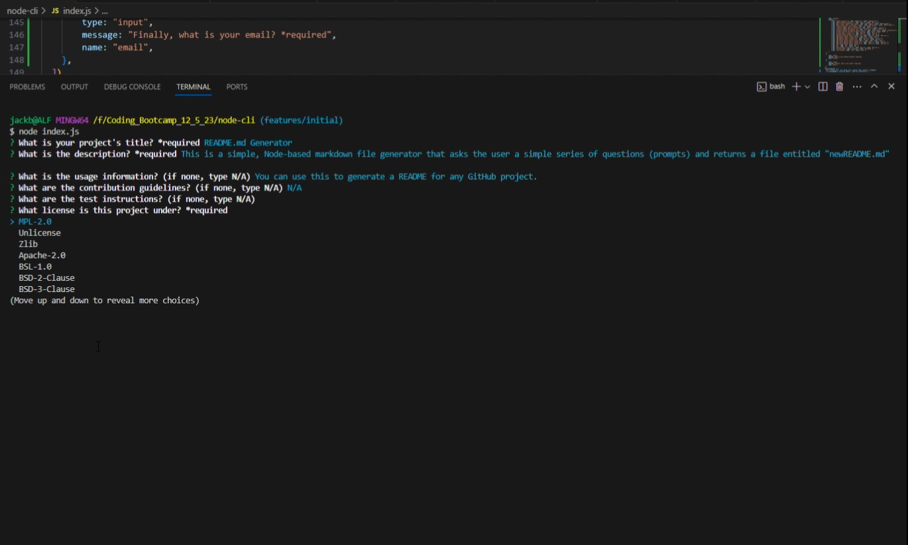

# README.md Generator

## Description
This is a simple, Node-based markdown file generator that asks the user a simple series of questions (prompts) and returns a file entitled "newREADME.md."  It will provide the user the chance to showcase a badge determined by the license as well as a link to the user's GitHub page.    

## Usage Information
[]
You can use this to generate a README for any GitHub project.  In fact, I used it to generate this very README!
## Questions
If you have any questions, you can reach me at jack.bittner@outlook.com.

<https://github.com/thejackbitt>